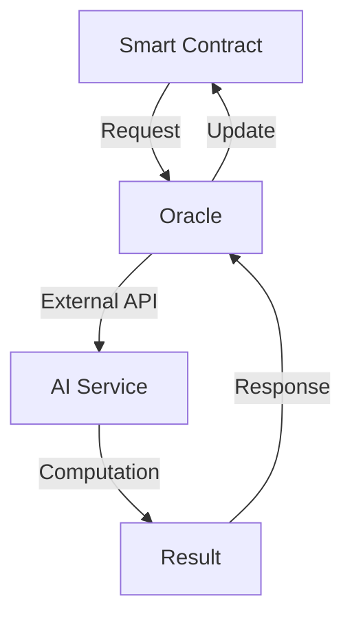

# Advanced Topics in AI Agent Development

This guide covers advanced concepts and techniques for building sophisticated AI agents on Nexis Network.

## Integrating Off-Chain Computation

### Architecture Overview

<Note>
Off-chain computation is essential for complex AI operations that would be too expensive to perform on-chain.
</Note>



### Implementation Example

```rust
#[ink::contract]
mod ai_oracle_bridge {
    #[ink(storage)]
    pub struct AIOracleBridge {
        owner: AccountId,
        oracle_address: AccountId,
        pending_requests: ink_storage::Mapping<u32, RequestData>,
        request_count: u32,
    }

    #[derive(scale::Encode, scale::Decode)]
    #[cfg_attr(feature = "std", derive(scale_info::TypeInfo))]
    pub struct RequestData {
        requester: AccountId,
        data_hash: Hash,
        callback_selector: [u8; 4],
        processed: bool,
    }

    impl AIOracleBridge {
        #[ink(message)]
        pub fn request_computation(&mut self, data_hash: Hash, callback: [u8; 4]) -> u32 {
            self.request_count += 1;
            let request = RequestData {
                requester: self.env().caller(),
                data_hash,
                callback_selector: callback,
                processed: false,
            };
            self.pending_requests.insert(self.request_count, &request);
            self.request_count
        }

        #[ink(message)]
        pub fn callback(&mut self, request_id: u32, result: Vec<u8>) {
            assert_eq!(self.env().caller(), self.oracle_address, "Unauthorized");
            let request = self.pending_requests.get(request_id)
                .expect("Request not found");
            
            // Process callback
            self.env().invoke_contract(
                request.requester,
                &request.callback_selector,
                &result,
                0,
            ).expect("Callback failed");
        }
    }
}
```

## Managing AI Agent State and Data

### State Management Patterns

1. **Hierarchical State Management**
```rust
#[derive(scale::Encode, scale::Decode)]
#[cfg_attr(feature = "std", derive(scale_info::TypeInfo))]
pub enum AgentState {
    Initializing,
    Training {
        epochs_completed: u32,
        current_accuracy: f32,
    },
    Inference {
        model_version: u32,
        confidence_threshold: f32,
    },
    Maintenance {
        reason: String,
        estimated_duration: u64,
    },
}
```

2. **Data Versioning**
```rust
#[ink(storage)]
pub struct VersionedAIModel {
    versions: ink_storage::Mapping<u32, ModelVersion>,
    current_version: u32,
}

#[derive(scale::Encode, scale::Decode)]
#[cfg_attr(feature = "std", derive(scale_info::TypeInfo))]
pub struct ModelVersion {
    weights: Vec<Vec<f32>>,
    timestamp: u64,
    accuracy: f32,
    training_data_hash: Hash,
}
```

## Security Considerations

### Access Control Implementation

```rust
#[ink::contract]
mod secure_ai_agent {
    #[ink(storage)]
    pub struct SecureAIAgent {
        owner: AccountId,
        operators: ink_storage::Mapping<AccountId, bool>,
        model_access: ink_storage::Mapping<AccountId, AccessLevel>,
    }

    #[derive(scale::Encode, scale::Decode)]
    #[cfg_attr(feature = "std", derive(scale_info::TypeInfo))]
    pub enum AccessLevel {
        ReadOnly,
        ReadWrite,
        Admin,
    }

    impl SecureAIAgent {
        #[ink(message)]
        pub fn grant_access(&mut self, account: AccountId, level: AccessLevel) {
            self.ensure_admin();
            self.model_access.insert(account, &level);
        }

        fn ensure_admin(&self) {
            assert!(
                matches!(self.model_access.get(self.env().caller()), Some(AccessLevel::Admin)),
                "Admin access required"
            );
        }
    }
}
```

### Secure Data Handling

```rust
#[ink::contract]
mod encrypted_data_sharing {
    #[ink(storage)]
    pub struct EncryptedDataSharing {
        encrypted_data: ink_storage::Mapping<Hash, EncryptedData>,
        access_keys: ink_storage::Mapping<(Hash, AccountId), Vec<u8>>,
    }

    #[derive(scale::Encode, scale::Decode)]
    #[cfg_attr(feature = "std", derive(scale_info::TypeInfo))]
    pub struct EncryptedData {
        data: Vec<u8>,
        metadata: String,
        owner: AccountId,
    }

    impl EncryptedDataSharing {
        #[ink(message)]
        pub fn share_data(&mut self, recipient: AccountId, encrypted_key: Vec<u8>, data_hash: Hash) {
            let data = self.encrypted_data.get(data_hash)
                .expect("Data not found");
            assert_eq!(data.owner, self.env().caller(), "Not data owner");
            
            self.access_keys.insert((data_hash, recipient), &encrypted_key);
        }
    }
}
```

## Performance Optimization

### Batch Processing

```rust
#[ink::contract]
mod batch_processor {
    #[ink(message)]
    pub fn process_batch(&mut self, inputs: Vec<Vec<i32>>) -> Vec<i32> {
        let mut results = Vec::with_capacity(inputs.len());
        
        for input in inputs {
            let result = self.process_single(input);
            results.push(result);
        }
        
        results
    }
}
```

### Memory Management

```rust
#[ink::contract]
mod optimized_storage {
    use ink_storage::traits::{
        SpreadAllocate,
        PackedLayout,
        SpreadLayout,
    };

    #[derive(PackedLayout, SpreadLayout)]
    #[cfg_attr(feature = "std", derive(scale_info::TypeInfo))]
    pub struct CompressedData {
        data: [u8; 32],
        metadata: u32,
    }

    #[ink(storage)]
    #[derive(SpreadAllocate)]
    pub struct OptimizedStorage {
        data: ink_storage::Mapping<u32, CompressedData>,
    }
}
```

## Cross-Contract Communication

### Contract Interaction

```rust
#[ink::contract]
mod ai_network {
    #[ink(storage)]
    pub struct AINetwork {
        models: ink_storage::Mapping<AccountId, bool>,
    }

    impl AINetwork {
        #[ink(message)]
        pub fn delegate_computation(&mut self, target: AccountId, input: Vec<u8>) -> Result<Vec<u8>> {
            assert!(self.models.get(target).unwrap_or(false), "Invalid model");
            
            self.env()
                .invoke_contract(target, &ink_selector_bytes!("compute"), &input, 0)
                .map_err(|_| Error::DelegationFailed)
        }
    }
}
```

## Future Considerations

### Upgradability Patterns

```rust
#[ink::contract]
mod upgradeable_ai_agent {
    #[ink(storage)]
    pub struct UpgradeableAIAgent {
        code_hash: Hash,
        admin: AccountId,
    }

    impl UpgradeableAIAgent {
        #[ink(message)]
        pub fn upgrade(&mut self, new_code_hash: Hash) {
            assert_eq!(self.env().caller(), self.admin, "Not authorized");
            self.code_hash = new_code_hash;
        }
    }
}
```

## Best Practices Summary

<CardGroup>
  <Card title="Security First" icon="shield">
    Implement robust access control and data encryption
  </Card>
  <Card title="Optimize Performance" icon="gauge">
    Use efficient data structures and batch processing
  </Card>
  <Card title="Maintainable Code" icon="code">
    Follow Rust best practices and documentation standards
  </Card>
</CardGroup>

## Next Steps

1. Implement advanced security measures
2. Optimize performance for specific use cases
3. Develop sophisticated AI algorithms
4. Build comprehensive testing suites

<Note>
Remember to always test thoroughly on testnet before deploying to mainnet, and consider having your contracts audited for security.
</Note> 